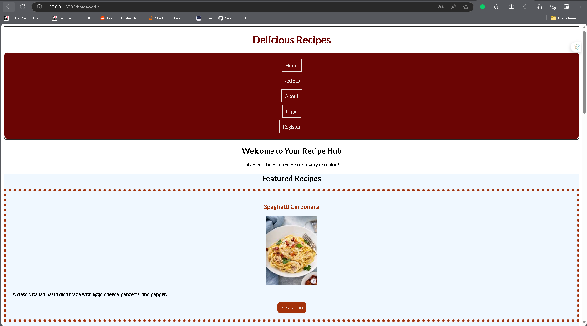
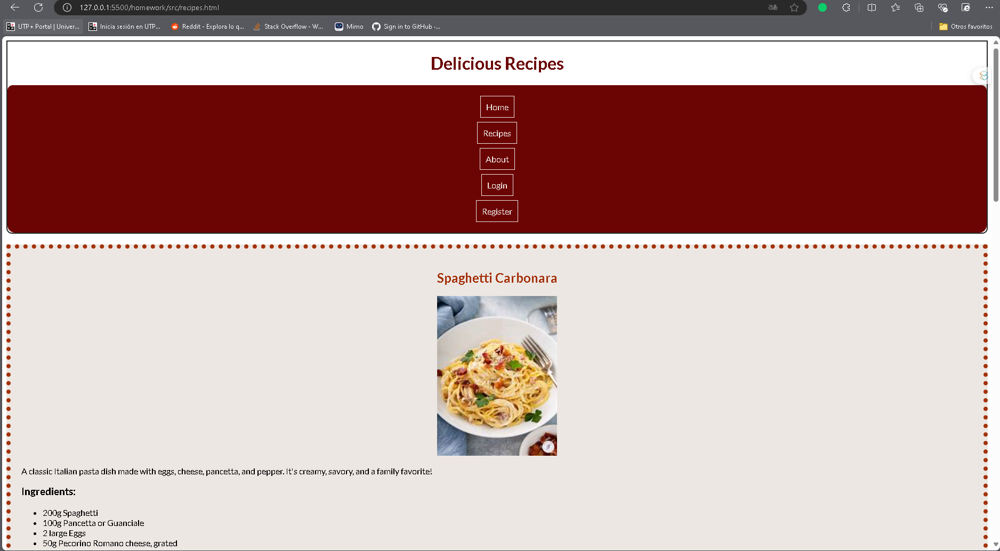
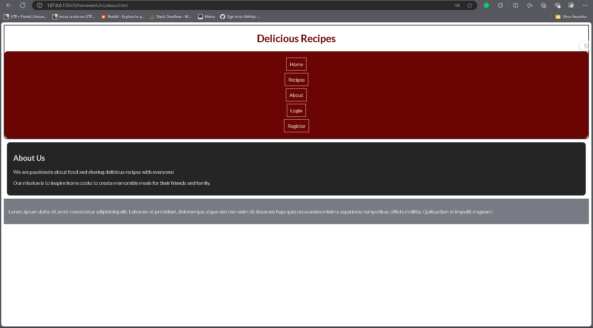
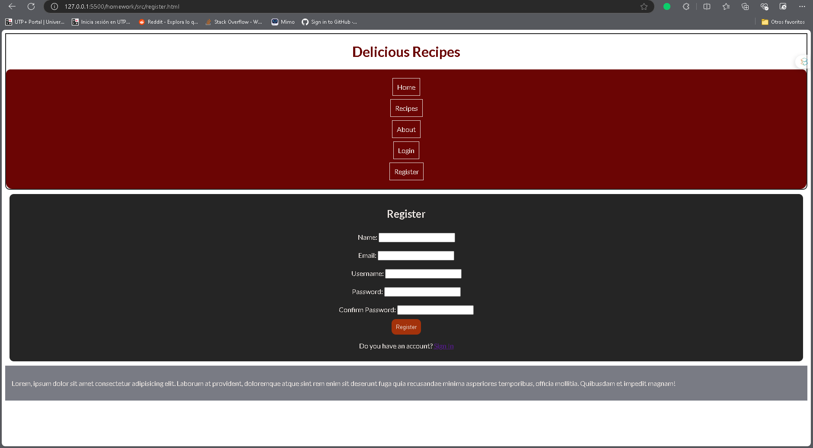

# README: Etiquetas HTML Utilizadas

Este documento describe las etiquetas HTML utilizadas en el proyecto "Delicious Recipes". Cada etiqueta se detalla junto con su propósito y uso.

## Etiquetas HTML

### 1. `<header>`
- **Descripción**: Sección que contiene el encabezado del documento, generalmente incluye el título y la navegación.
- **Uso**: Agrupa el título del sitio y los enlaces de navegación.

### 2. `<nav>`
- **Descripción**: Sección de navegación.
- **Uso**: Contiene enlaces a otras páginas del sitio, permitiendo la navegación fácil y accesible.

### 3. `<main>`
- **Descripción**: Sección principal del documento.
- **Uso**: Contiene el contenido central del sitio, diferenciándolo de otros elementos como encabezados y pies de página.

### 4. `<section>`
- **Descripción**: Agrupa contenido relacionado.
- **Uso**: Utilizada para dividir el contenido en partes lógicas, facilitando la lectura.

### 5. `<article>`
- **Descripción**: Representa contenido independiente que puede ser distribuido o sindicado.
- **Uso**: Cada receta es un artículo, permitiendo que se entienda como una unidad de contenido.

### 6. `<h1>`, `<h2>`, `<h3>`
- **Descripción**: Etiquetas de encabezado que indican niveles de importancia.
  - `<h1>`: Título principal de la página.
  - `<h2>`: Subtítulos que dividen secciones principales.
  - `<h3>`: Subtítulos de menor jerarquía dentro de un artículo.
- **Uso**: Organizan el contenido jerárquicamente, mejorando la accesibilidad y SEO.

### 7. `<p>`
- **Descripción**: Representa un párrafo de texto.
- **Uso**: Se utiliza para añadir descripciones y texto explicativo.

### 8. ``
- **Descripción**: Incrusta una imagen en la página.
- **Uso**: Utilizada para mostrar imágenes de recetas, con un atributo `alt` para accesibilidad.

### 9. `<button>`
- **Descripción**: Representa un botón clickable.
- **Uso**: Utilizado para acciones como "Ver receta".

### 10. `<ul>` y `<ol>`
- **Descripción**:
  - `<ul>`: Lista no ordenada.
  - `<ol>`: Lista ordenada.
- **Uso**: Utilizadas para mostrar ingredientes (lista no ordenada) y pasos de instrucciones (lista ordenada).

### 11. `<form>`
- **Descripción**: Sección que contiene controles interactivos para enviar datos.
- **Uso**: Utilizada en las páginas de registro e inicio de sesión para recibir información del usuario.

### 12. `<label>`
- **Descripción**: Asocia un texto a un control de formulario.
- **Uso**: Mejora la accesibilidad al hacer que el formulario sea más fácil de usar.

### 13. `<input>`
- **Descripción**: Campo donde el usuario puede ingresar datos.
- **Uso**: Utilizado en formularios para recibir datos como nombre, correo electrónico y contraseña.

### 14. `<footer>`
- **Descripción**: Sección que contiene información de cierre del documento.
- **Uso**: Proporciona información adicional como derechos de autor y contacto.

---

# Estilos CSS para la Página Web

Este documento describe los estilos CSS aplicados a la página web, proporcionando una visión general de las propiedades y estructuras utilizadas para dar formato a los diferentes elementos.

## 1. Importación de Fuentes

```css
@import url('https://fonts.googleapis.com/css2?family=Cormorant+Garamond&family=Lato&display=swap');
```
Se importan fuentes desde Google Fonts, específicamente **Cormorant Garamond** y **Lato**, para mejorar la tipografía de la página.

## 2. Estilos Globales

```css
*, *::before, *::after {
    box-sizing: border-box;
}
```
Se establece que el modelo de caja de todos los elementos incluya el padding y el borde en su tamaño total, facilitando el control del diseño.

## 3. Estilos del `body`

```css
body {
    font-family: 'Lato', 'Cormorant Garamond', 'Arial';
}
```
Define la fuente principal del documento, asegurando una tipografía coherente en toda la página.

## 4. Estilos del `header`

```css
.nav-bar {
    position: relative;
    border: 2px solid #252525;
    border-radius: 0 0 10px 10px;
}
```
La barra de navegación tiene un borde y esquinas redondeadas, mejorando su presentación visual.

## 5. Navegación (`nav`)

```css
nav {
    background-color: #6B0504;
    border-radius: 10px;
    padding: 5px;
    top: 120%;
}
```
El menú de navegación se estiliza con un color de fondo oscuro y bordes redondeados, y se desplaza hacia abajo en la página.

## 6. Listas de Navegación

```css
.nav-main li {
    list-style: none;
    text-align: center;
    margin: 10px 0;
}
```
Se eliminan las viñetas de las listas y se centran los elementos para una mejor presentación.

## 7. Tarjetas de Recetas

```css
.card-recipe {
    border: 8px dotted #A3320B;
    padding: 20px;
    margin: 20px 0;
}
```
Las tarjetas de recetas tienen un borde punteado y se separan adecuadamente con margen y relleno.

## 8. Botones de Receta

```css
.btn-recipe {
    background-color: #A3320B;
    color: #EDE7E3;
    border-radius: 10px;
    padding: 10px;
}
```
Los botones tienen un fondo oscuro y texto claro, con bordes redondeados y un tamaño de padding que mejora la usabilidad.

## 9. Footer

```css
footer {
    background-color: #797B84;
    color: #EDE7E3;
    padding: 15px;
}
```
El pie de página tiene un fondo gris y texto claro, proporcionando una apariencia uniforme y profesional.

## 10. Formularios

```css
.form {
    padding: 10px 15px;
    border: 1px dashed #252525;
    background-color: #252525;
    color: #EDE7E3;
}
```
Los formularios se destacan con un borde punteado y un fondo oscuro, mejorando la experiencia del usuario.

## Imágenes

A continuación se presentan algunas capturas de pantalla de la aplicación:

### Página de inicio


### Recetas


### Acerca de


### Iniciar sesión


### Registrarse

